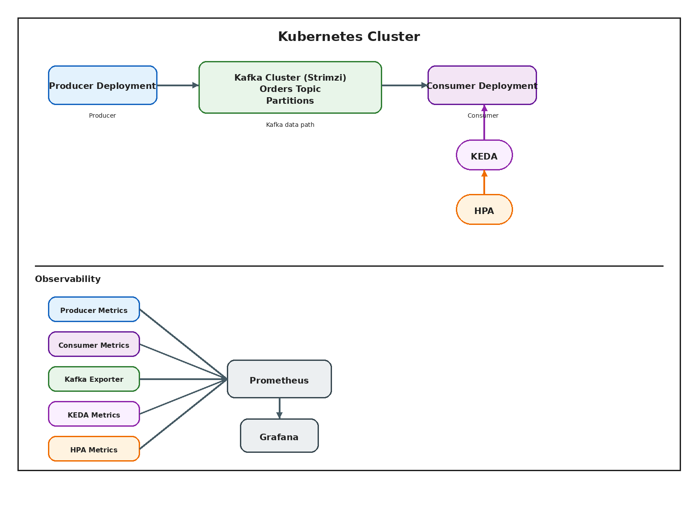
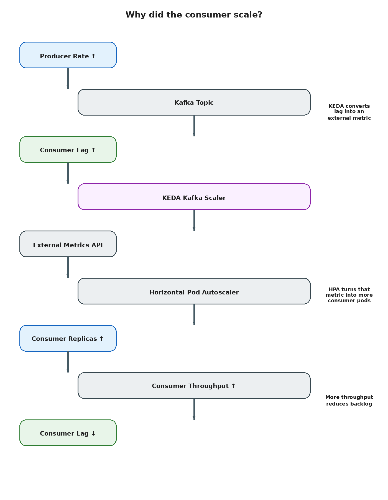

# Kafka KEDA Autoscaling

A production-quality educational project demonstrating lag-driven autoscaling for Kafka consumers on Kubernetes using KEDA and Strimzi.

## Problem Statement

In event-driven systems, message consumption rate rarely matches message production rate. When producers generate messages faster than consumers can process them, consumer lag increases, delaying critical business processes.

This project demonstrates how to use KEDA to monitor Kafka consumer lag and automatically scale consumer workloads on Kubernetes, while providing end-to-end observability into every scaling decision.

## Key Features

- **Lag-Based Autoscaling**: Consumer deployment scales from 2 to 10 replicas based on Kafka lag using KEDA.
- **Explicit Kafka Semantics**: Demonstrates manual offset commits for at-least-once delivery and graceful shutdown handling.
- **End-to-End Observability**: Includes a Grafana dashboard to correlate producer throughput, consumer lag, and KEDA scaling decisions.
- **Production-Ready Services**: Python producer/consumer with structured logging, health endpoints, and efficient configuration.
- **Declarative Platform**: Kafka cluster and topics deployed on Kubernetes via the Strimzi operator.
- **Failure Engineering**: Includes guides for testing and validating system behavior under load and during failures.

## A Focus on Explainable Autoscaling

Unlike most Kafka autoscaling demos, this project focuses on **understanding why scaling happens**.

The included Grafana dashboard correlates:

Producer Throughput

↓

Consumer Throughput

↓

Kafka Lag

↓

KEDA Metrics

↓

HPA Decisions

...allowing every scaling event to be explained using telemetry.

## Technology Stack

| Layer | Technology |
|-------------------------|--------------|
| Container Orchestration | Kubernetes |
| Event Streaming | Apache Kafka |
| Kafka Operator | Strimzi |
| Autoscaling | KEDA |
| Metrics | Prometheus |
| Dashboard | Grafana |
| Language | Python |

## Architecture



The scaling loop that explains consumer replica changes is shown here:



## Repository Structure

```text
.
├── application/     # Producer/Consumer code, Dockerfiles, and local Compose setup
├── docs/            # In-depth documentation and guides
├── diagrams/        # System architecture diagrams
├── observability/   # Prometheus/Grafana monitoring assets
├── platform/        # Kubernetes manifests for Strimzi and KEDA
└── README.md
```

## Quick Start

### Local Development

The easiest local path is the Docker Compose setup in `application/`.

```bash
cd application
docker-compose up -d
docker-compose down
```

### Kubernetes deployment

Once you have a Kubernetes cluster with Strimzi and KEDA installed, you can deploy the services.

For a complete, step-by-step guide on building the container images and deploying all the manifests, please follow the **Kubernetes Deployment Guide**.

## Configuration

The main runtime settings are documented in [application/env.example](application/env.example).

Common knobs:

- `KAFKA_BOOTSTRAP_SERVERS`
- `KAFKA_TOPIC`
- `MESSAGE_RATE_PER_SEC`
- `PROCESSING_DELAY_SECONDS`
- `KAFKA_CONSUMER_GROUP`
- `LOG_LEVEL`

## Observability

The repo includes monitoring assets for Kafka, the producer, the consumer, and KEDA:

- Prometheus `ServiceMonitor` and `PodMonitor` resources in `observability/prometheus/`
- A Grafana dashboard JSON in `observability/grafana/`

See [docs/dashboard-guide.md](docs/dashboard-guide.md) for setup and usage.

## Validation And Troubleshooting

- [docs/validation-guide.md](docs/validation-guide.md)
- [docs/troubleshooting.md](docs/troubleshooting.md)
- [docs/lessons-learned.md](docs/lessons-learned.md)
- [docs/experiments.md](docs/experiments.md)

## Repository Structure

```text
.
├── application/
├── docs/
├── diagrams/
├── observability/
├── platform/
└── README.md
```

## Related Docs

- [application/README.md](application/README.md)
- [application/ARCHITECTURE.md](application/ARCHITECTURE.md)
- [docs/architecture.md](docs/architecture.md)
- [docs/deployment-guide.md](docs/deployment-guide.md)

## License

See [LICENSE](LICENSE).
