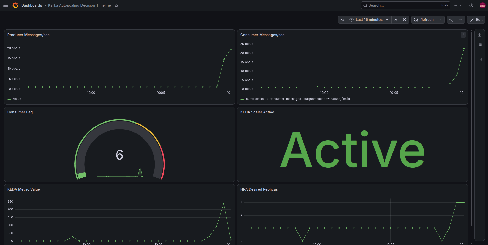
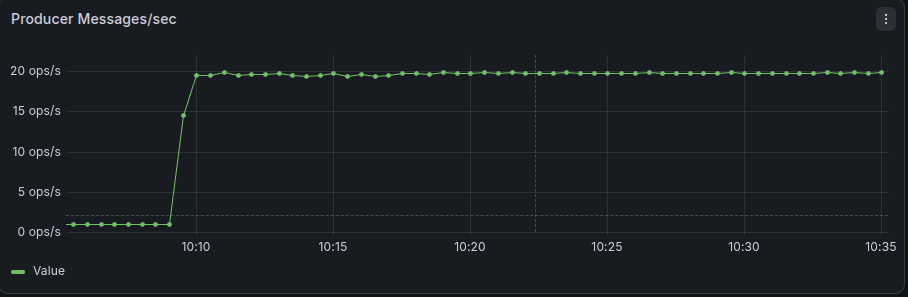
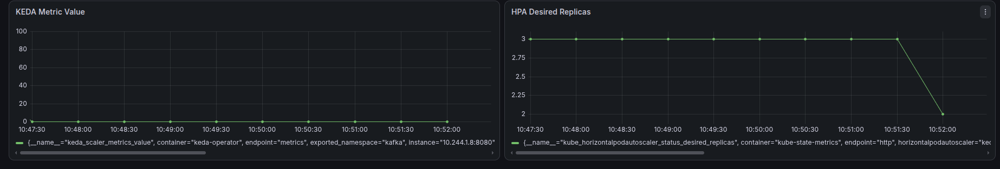
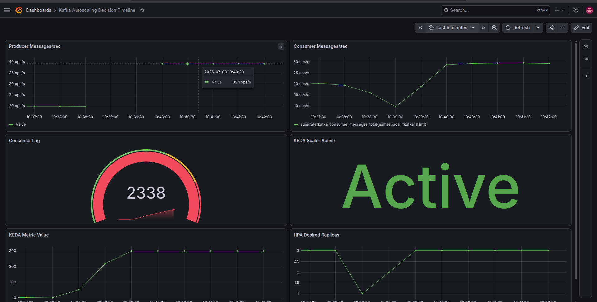
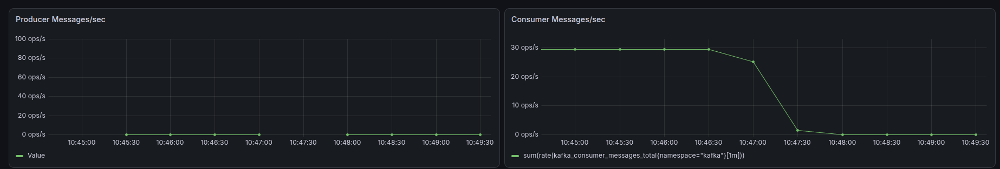

# Dashboard Guide: Explaining Autoscaling Decisions

## 1. Purpose

The purpose of this dashboard is not just to monitor Kafka—it is to **explain autoscaling decisions through correlated telemetry**.

While other dashboards might show you CPU usage or message throughput, this one is designed to answer a specific question: **"Why did the number of consumer replicas change?"** It achieves this by visualizing the entire cause-and-effect chain, from message production to the HPA's scaling action.

## 2. Dashboard Overview

The dashboard is organized to be read from left to right, following the flow of data and decisions through the system.

The same scaling loop is summarized in this diagram:

](../images/dashboard.png)

The logical flow is:
1.  **Producer Activity**: How many messages are being sent into the system?
2.  **Consumer Activity**: How many messages are being processed?
3.  **System State (Lag)**: What is the difference between production and consumption? This is the backlog.
4.  **KEDA's Observation**: How does KEDA see the lag? Is it time to act?
5.  **Kubernetes' Reaction**: How does the Horizontal Pod Autoscaler (HPA) respond to KEDA's signal?

## 3. Investigation Workflow

A scaling event happened. How do you use this dashboard to explain why?

Follow the panels from top to bottom to build a narrative.

1.  **Producer Rate**: Did the number of incoming messages suddenly increase or decrease? This is the most common trigger.
    > Look at the `Producer Messages / sec` panel.

2.  **Consumer Rate**: Did the consumers' ability to process messages change? Perhaps they slowed down due to a bug or resource contention.
    > Look at the `Consumer Messages / sec` panel.

3.  **Consumer Lag**: Given the producer and consumer rates, what was the impact on the backlog? A mismatch between the two will cause lag to rise or fall.
    > Look at the `Consumer Lag` panel. This is the primary signal for scaling.

4.  **KEDA Activation**: Did the lag cross the threshold defined in the `ScaledObject`? KEDA will only become active when the lag is significant enough.
    > Look at the `KEDA Scaler Active` panel. A value of `1` means KEDA is telling the HPA to scale.

5.  **HPA Decision**: Based on KEDA's signal, what did the HPA decide to do? The HPA makes the final decision on the desired number of replicas.
    > Look at the `HPA Desired vs. Current Replicas` panel. You will see the "desired" count change first, followed by the "current" count as new pods come online.

By following this workflow, you can confidently state, for example: *"At 10:30 AM, the producer rate spiked from 10 to 50 messages/sec. This caused consumer lag to exceed the 100-message threshold, activating KEDA, which instructed the HPA to scale the consumer deployment from 2 to 6 replicas."*

## 4. Panel Reference

### Row 1: Throughput & Lag

#### Panel: Producer Messages / sec
- **Question:** What is the rate of new events entering the system?
- **PromQL Query:** `sum(rate(kafka_producer_messages_total[1m]))`
- **Interpretation:** A spike here is the most common cause of a scale-up event. A drop can signal a producer-side issue or the start of a scale-down event.

#### Panel: Consumer Messages / sec
- **Question:** What is the processing throughput of the entire consumer group?
- **PromQL Query:** `sum(rate(kafka_consumer_messages_total[1m]))`
- **Interpretation:** This rate should ideally track the producer rate. If it's consistently lower, lag will build. As more replicas are added during a scale-up, this rate should increase.

### Row 2: KEDA & HPA Decisions

#### Panel: Consumer Lag
- **Question:** How many messages are waiting to be processed?
- **PromQL Query:** `sum(kafka_consumergroup_lag{consumergroup="order-processors"}) by (topic)`
- **Interpretation:** This is the most critical panel. It represents the workload backlog. When this value crosses the `lagThreshold` in the `ScaledObject`, KEDA will trigger scaling.

#### Panel: KEDA Scaler Active
- **Question:** Is KEDA currently telling the HPA to scale the deployment?
- **PromQL Query:** `keda_scaler_active{scaler_name="kafka"}`
- **Interpretation:**
    - `1`: Active. The lag is above the threshold, and KEDA is providing a metric to the HPA.
    - `0`: Inactive. The lag is below the threshold. KEDA will instruct the HPA to scale down to `minReplicas` (or zero).

### Row 3: Application Health

#### Panel: KEDA Metric Value vs. Threshold
- **Question:** What is the exact metric value KEDA is reporting to the HPA?
- **PromQL Query:** `keda_scaler_metrics_value{scaler_name="kafka"}`
- **Interpretation:** This shows the calculated metric that the HPA uses to determine the replica count. It is directly proportional to the lag. The panel also displays the `lagThreshold` as a constant line, making it easy to see when scaling is triggered.

#### Panel: HPA Desired vs. Current Replicas
- **Question:** How many replicas does the HPA want, and how many are actually running?
- **PromQL Queries:**
    - `kube_hpa_spec_replicas{hpa="kafka-consumer-hpa"}` (Desired)
    - `kube_hpa_status_current_replicas{hpa="kafka-consumer-hpa"}` (Current)
- **Interpretation:** This is the final outcome. You will see the "desired" line jump up or down first in response to KEDA. The "current" line will follow as Kubernetes schedules or terminates pods.

## 5. Investigation Examples

These examples correspond to the scenarios in `experiments.md`.

### Example 1: Producer Surge

- **Narrative**: The `Producer Messages / sec` panel shows a sharp spike. Shortly after, the `Consumer Lag` panel shows a corresponding rise. Once the lag crosses the threshold, `KEDA Scaler Active` flips to 1, and the `HPA Desired Replicas` count increases.
- **Conclusion**: The system scaled up correctly in response to an increased load.

### Example 2: Consumer Failure

- **Narrative**: The `Consumer Messages / sec` panel suddenly drops, even though the producer rate is stable. `Consumer Lag` begins to climb steadily. KEDA and the HPA react by scaling up to compensate for the lost processing capacity.
- **Conclusion**: The system automatically recovered from a partial processing failure by adding new capacity.

### Example 3: Partition Limit

- **Narrative**: The producer rate is very high and lag is growing, but the `HPA Desired Replicas` panel shows the replica count is "stuck" at a certain number (e.g., 3).
- **Conclusion**: The consumer group is limited by the number of topic partitions. More replicas would be idle. To increase throughput further, the topic's partition count must be increased.

### Example 4: Wrong Configuration

- **Narrative**: The `Producer Messages / sec` panel is at zero, and the `Producer & Consumer Errors` panel shows a high rate of producer errors. No scaling occurs because no messages are entering the system.
- **Conclusion**: This is not a scaling issue but a configuration fault. The dashboard helps rule out scaling problems and points the investigation toward application logs.

## 6. Dashboard Limitations

This dashboard is excellent for explaining *why* scaling happened, but it has limitations.

#### What the Dashboard Cannot Tell You:
- **The Root Cause of an Error**: If the `Errors` panel shows a spike, the dashboard won't tell you if it's a `ConnectionRefusedError` or a `JSONDecodeError`. For that, you need logs.
- **Individual Pod Behavior**: The dashboard aggregates metrics across the group. If one specific pod is slow or stuck, you'll need to inspect pod-level logs and metrics.
- **Kafka Broker Health**: This dashboard focuses on the client perspective. It won't diagnose issues with the Kafka brokers themselves (e.g., disk space, under-replicated partitions).

#### When Logs Are Required:
- Investigating any non-zero value in the **Errors** panel.
- Debugging **configuration issues** (e.g., wrong bootstrap server, invalid topic).
- Understanding **consumer rebalancing events**.

## 7. Related Documents

- **architecture.md**: For understanding the overall system design.
- **experiments.md**: For details on how to reproduce the investigation examples.
- **troubleshooting.md**: For a step-by-step guide to solving common problems.
